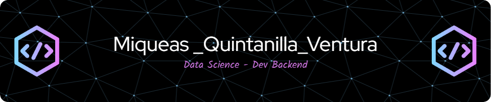

  

 Bienvenido a mi rincón en GitHub, donde la magia del backend, la ciencia de datos y el desarrollo de software se encuentran! 🚀

## 👨‍💻 Sobre mí

Soy un apasionado desarrollador de backend con una fuerte inclinación hacia la ciencia de datos y el desarrollo de soluciones de software eficientes y escalables. Con 3 de experiencia en la industria, he colaborado en proyectos que van desde aplicaciones empresariales hasta innovadoras startups.

## 📫 Cómo encontrarme

       

## 🛠️ Tecnologías y Herramientas

- **Lenguajes de Programación:** Python 🐍, Java ☕, C# ⚔️
- **Frameworks y Bibliotecas:** Django, Flask, .NET, Spring Boot
- **Bases de Datos:** PostgreSQL, MongoDB, Redis
- **Ciencia de Datos:** TensorFlow, Pandas, NumPy, Scikit-Learn
- **DevOps:** Docker 🐳, Kubernetes, CI/CD (Jenkins, GitHub Actions)
- **Herramientas:** Git, Jupyter Notebook, VS Code, Postman

## 🌟 Proyectos Destacados

- **Proyecto X:** Sistema de recomendación basado en machine learning para un e-commerce. [Ver más](#)
- **Proyecto Y:** API RESTful para gestión de transacciones en tiempo real en un banco digital. [Ver más](#)
- **Proyecto Z:** Plataforma de análisis de datos para predicción de tendencias de mercado. [Ver más](#)

## 📈 Estadísticas de GitHub

![Estadísticas de GitHub de Miqueas (https://github-readme-stats.vercel.app/api?username=[Miqueas7]&show_icons=true&theme=radical)

## 💡 Citas favoritas

> "En la simplicidad está la última sofisticación." - Leonardo da Vinci
> "Los datos son el nuevo petróleo." - Clive Humby

¡Gracias por visitar mi perfil y espero que encuentres inspiración e interés en mis proyectos!
