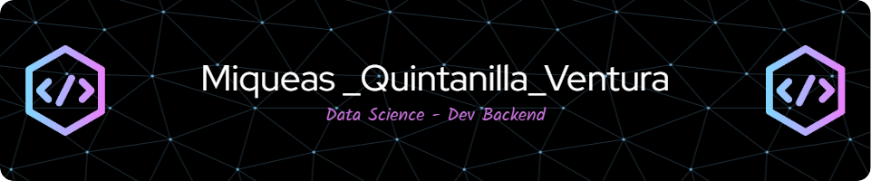

Bienvenido a mi rincón en GitHub, donde la magia de la ciencia de datos, backend y el desarrollo de software se encuentran! 🚀

##    SOBRE MÍ

Ingeniero de Minas (UNSCH) y Magíster en Ingeniería de Software (UNMSM). Llevo más de 10 años en operaciones mineras peruanas y construyo lo que falta entre la data de una operación y la decisión que alguien tiene que tomar con ella: modelos de machine learning que llegan a producción, gemelos digitales y plataformas de gestión.

Trabajo bajo acuerdos de confidencialidad, así que los proyectos los presento por su **método y sus resultados, no por el nombre del cliente**. Están publicados como model cards —con sus métricas, su ETL, su arquitectura y sus hallazgos— en **[miqueas.dev](https://miqueas.dev)**.

Docente de analítica y machine learning aplicados a minería en GEOMINA, Escuela Global y CODE@UNI. Profesor asistente en la UNMSM y Mentor del Programa de Mentoring del IIMP.

## 📫 CÓMO ENCONTRARME

🌐 **[miqueas.dev](https://miqueas.dev)** — portafolio con las model cards y sus métricas


[](https://www.linkedin.com/in/mqv/)  [](https://web.facebook.com/Miqueas.Quintanilla)  []( https://w.app/Miqueas)   [](https://www.instagram.com/miqueasquintanilla/)  [](https://twitter.com/MiCkYMattheus)  [](https://t.me/Miqui7)  [](https://discordapp.com/users/1010018201339445389)

## 🌬️ VENTPY — LIBRERÍA OPEN SOURCE DE VENTILACIÓN DE MINAS

```bash
pip install ventpy
```

Durante años vi el mismo cálculo vivir en una hoja de Excel: rehecha desde cero por quien la necesitara, con las constantes normativas escritas a mano, sin tests y sin una fuente común. Y no es un número trivial — si ventilas de menos una labor, hay gente respirando gases de diésel durante todo un turno.

Busqué una implementación abierta y no existía. Así que la escribí.

| | |
|---|---|
| **Demanda de aire** | personal, flota diésel, dilución post-voladura, correcciones por altitud, fugas |
| **Redes** | topología, mallas automáticas, balance de Hardy-Cross con convergencia auditable |
| **Ventiladores** | curvas con corrección por densidad, punto de operación, detección de zona de stall |
| **Y además** | resistencias de Atkinson, ductos, polvo respirable, balance térmico, cobertura |
| **Normas** | Perú (DS 024-2016-EM) y Chile (DS 132) — **cada constante cita su artículo** |

Núcleo en C++20 con bindings de Python. 345 tests, incluyendo *property-based testing*, corriendo en Linux, macOS y Windows con sanitizers y umbral de cobertura.

Si le pides un gas que la norma no regula, **falla con un error** en vez de devolver un valor por defecto. En una librería de la que depende cuánto aire respira alguien bajo tierra, un default silencioso es peligroso.

**[Documentación](https://miqueas.dev/ventpy)** · **[PyPI](https://pypi.org/project/ventpy/)** · **[Repositorio](https://github.com/Miqueas7/VentPy)**

> **Faltan Colombia y México, y no necesitas saber programar para aportar.** Abre un issue con los valores de tu normativa y el artículo del que salen. Eso ya es la mitad del trabajo — el código lo pongo yo.

## 🌟 PROYECTOS DESTACADOS

**Ingeniería y minería**

- **[Cobertura de Oxígeno](https://github.com/Miqueas7/Cobertura_de_Oxigeno)** — Software para determinar la cobertura de oxígeno. El antecedente directo de VentPy.
- **[Control de Hidrocarburos](https://github.com/Miqueas7/Repositorio-Freelancer)** — Software para el control de hidrocarburos.
- **[Solar Pro](https://github.com/Miqueas7/Solar_Pro)** — Software para el control de energía solar en el Perú.

**Herramientas y datos**

- **[API DB](https://github.com/Miqueas7/API-DB)** — API para administrar bases de datos en la nube.
- **[Administrador de Bases de Datos](https://github.com/Miqueas7/Administrador_Bases_datos)** — Administración de bases de datos en local, configurando puerto y credenciales.
- **[Instalador PY](https://github.com/Miqueas7/Instalador-Py)** — Instalador de complementos de Excel y otros archivos.

**Trabajos para terceros**

- **[Repositorio Freelancer](https://github.com/Miqueas7/Repositorio-Freelancer)** — Proyectos realizados para clientes.
- **[Landing Frutayapp](https://github.com/Miqueas7/frutayapp-landing-main)** · **[Landing Ayalzzich](https://github.com/Miqueas7/ayalzzich-landing-main)**

## 🛠️ TECNOLOGÍAS Y HERRAMIENTAS

## DATA SCIENCE


## BACKEND


## API


## DATABASES


## FRAMEWORKS


## HERRAMIENTAS


## FRONTEND


## OTROS LENGUAJES Y HERRAMIENTAS (APRENDIZAJE)


## 📈 ESTADÍSTICAS DE GITHUB
 


[](https://github.com/ryo-ma/github-profile-trophy)      

## 📈 VIDEOS DE YOUTUBE
<table style="width:10%">
  <tr>
    <td>
      <a href="https://www.youtube.com/watch?v=CKB7C3x_NH4&t=17s&ab_channel=SergioAlejandroCampos-EXCELeINFO">
        
      </a>
    </td>
  </tr>
</table>

## 💡 CITAS FAVORITAS
> "El que no vive para servir, no sirve para vivir." - Madre Teresa de Calcuta

> "En la simplicidad está la última sofisticación." - Leonardo da Vinci

> "Los datos son el nuevo petróleo." - Clive Humby

## ¡Gracias por visitar mi perfil y espero que encuentres inspiración e interés en mis proyectos!
